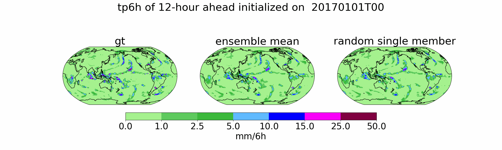
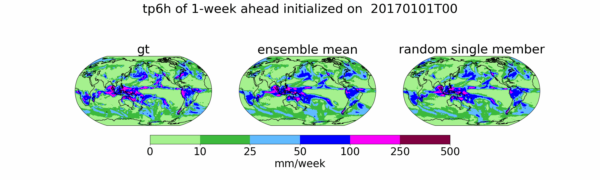

# FengWu-W2S.onnx 
FengWu-W2S:Revisiting the potential for seamless forecasting in AI Weather Models

## Demos
### Demo 1: hourly_6-hour precipitation (tp6h)


### Demo 2: weekly_6-hour precipitation (tp6h)



### Demo 3: 25km Typhoon 850hPa Wind Speed initial from 2024-06-21T00 

*You can observe the generation process of multiple typhoons in late July, as highlighted in member 23.*


## Getting started
### 1. Clone the code and prepare environment (if necessary) using the following command:
```bash
$ git clone https://github.com/LingFH/FengWu-W2S.onnx.git
$ conda create -n fengwu_w2s python=3.10 -y
$ conda activate fengwu_w2s
$ python3 -m pip install -r requirements.txt
```
### 2. Modify the configuration file and prapare the data like "input_data0"
The configuration file allows you to set various parameters for model execution, including the number of steps (n*6h), the magnitude of initial perturbations, and the number of members. Future updates will introduce more flexible and customizable parameters.

Input files should resemble "input_data0" and cover the range of **90N to -90N and 0 to 360E**. The order of data features must follow the configuration file, starting from **u10 to mwp**, and then including different heights for **z, q, u, v, and t, ranging from 50 to 1000 hPa**.

By the way, don't deal with the **SST and other wave variable. Nan will be handled in the function**. If the data structure and data characteristics do not match, error predictions may occur.

## Onnx link

We offer two versions of our model:

1. **140 km Resolution**: For access to this version, please contact us at [lingfenghua@pjlab.org.cn](mailto:lingfenghua@pjlab.org.cn) 
   
2. **25 km Resolution**: This version includes stratospheric data and provides enhanced spatial detail, making it particularly effective for predicting extreme weather events, similar to the results shown in Demo 3. The 25 km model will be open-sourced following the acceptance of the manuscript.

Feel free to reach out if you would like to obtain either version.

## Citation
```
@article{Ling2024,
  title={FengWu-W2S: A deep learning model for seamless weather-to-subseasonal forecast of global atmosphere},
  author={Fenghua Ling and Kang Chen and Jiye Wu and Tao Han and Jing-Jia Luo and Wanli Ouyang and Lei Bai},
  journal={arXiv preprint arXiv:2411.10191},
  year={2024},
  url={https://arxiv.org/abs/2411.10191}
  }
